# FreshCart Class Diagrams

Mermaid class diagrams for the implemented services. Render with any Mermaid-aware viewer
(GitHub markdown does it natively).

The diagrams show the dependency direction: every arrow `A --> B` means "A depends on B".
For the Clean Architecture services the arrows therefore all point inward.

---

## BuildingBlocks

```mermaid
classDiagram
    class ICommand~TResponse~ {
        <<interface>>
    }
    class ICommandHandler~TCommand_TResponse~ {
        <<interface>>
        +Handle(TCommand, CancellationToken) Task~TResponse~
    }
    class IQuery~TResponse~ {
        <<interface>>
    }
    class IQueryHandler~TQuery_TResponse~ {
        <<interface>>
        +Handle(TQuery, CancellationToken) Task~TResponse~
    }
    class ValidationBehavior~TRequest_TResponse~ {
        -IEnumerable~IValidator~ validators
        +Handle(TRequest, RequestHandlerDelegate, CancellationToken) Task~TResponse~
    }
    class LoggingBehavior~TRequest_TResponse~ {
        -ILogger logger
        +Handle(TRequest, RequestHandlerDelegate, CancellationToken) Task~TResponse~
    }
    class CustomExceptionHandler {
        -ILogger logger
        +TryHandleAsync(HttpContext, Exception, CancellationToken) ValueTask~bool~
    }
    class DomainException
    class NotFoundException
    class BadRequestException
    class ConflictException
    class ForbiddenException
    class InternalServerException
    class PaginationRequest {
        +int PageNumber
        +int PageSize
        +Normalise() PaginationRequest
    }
    class PaginatedResult~TItem~ {
        +int PageNumber
        +int PageSize
        +long TotalItemCount
        +IReadOnlyList~TItem~ Items
    }
    class OutboundUrlAllowListHandler {
        -HashSet~string~ allowedHosts
        #SendAsync(HttpRequestMessage, CancellationToken) Task~HttpResponseMessage~
    }

    ICommandHandler~TCommand_TResponse~ ..|> ICommand~TResponse~
    IQueryHandler~TQuery_TResponse~ ..|> IQuery~TResponse~
    DomainException --|> Exception
    NotFoundException --|> Exception
    BadRequestException --|> Exception
    ConflictException --|> Exception
    ForbiddenException --|> Exception
    InternalServerException --|> Exception
    CustomExceptionHandler ..> NotFoundException
    CustomExceptionHandler ..> BadRequestException
    CustomExceptionHandler ..> ConflictException
    CustomExceptionHandler ..> ForbiddenException
    CustomExceptionHandler ..> InternalServerException
    CustomExceptionHandler ..> DomainException
```

---

## Identity service

### Domain

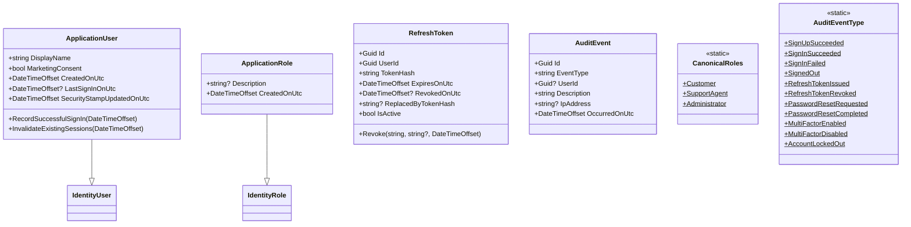

### Application

```mermaid
classDiagram
    class SignUpCommand {
        +string Email
        +string Password
        +string DisplayName
        +bool MarketingConsent
        +bool SignInImmediately
    }
    class SignUpCommandHandler {
        +Handle(SignUpCommand, CancellationToken) Task~SignUpResult~
    }
    class SignInCommand {
        +string Email
        +string Password
        +string? MultiFactorCode
        +bool UseCookie
        +bool RememberMe
    }
    class SignInCommandHandler {
        +Handle(SignInCommand, CancellationToken) Task~SignInResult~
    }
    class SignOutCommand {
        +Guid UserId
    }
    class SignOutCommandHandler
    class RefreshAccessTokenCommand {
        +string RefreshToken
    }
    class RefreshAccessTokenCommandHandler
    class GetCurrentUserQuery {
        +Guid UserId
    }
    class GetCurrentUserQueryHandler
    class IAccessTokenIssuer {
        <<interface>>
        +Issue(ApplicationUser, IReadOnlyCollection~string~) AccessTokenIssueResult
    }
    class IRefreshTokenService {
        <<interface>>
        +IssueAsync(Guid, string?, string?, CancellationToken) Task~RefreshTokenIssueResult~
        +RotateAsync(string, string?, string?, CancellationToken) Task~RefreshTokenRotateResult~
        +RevokeAllForUserAsync(Guid, string, CancellationToken) Task
    }
    class IIdentityAuditLog {
        <<interface>>
        +RecordAsync(AuditEvent, CancellationToken) Task
    }
    class ICurrentRequestContext {
        <<interface>>
        +string? IpAddress
        +string? UserAgent
        +string? CorrelationId
        +Guid? AuthenticatedUserId
    }
    class AuthenticationProfile {
        +Guid UserId
        +string Email
        +string DisplayName
        +IReadOnlyCollection~string~ Roles
        +bool MultiFactorEnabled
    }

    SignUpCommandHandler ..> IAccessTokenIssuer
    SignUpCommandHandler ..> IRefreshTokenService
    SignUpCommandHandler ..> IIdentityAuditLog
    SignUpCommandHandler ..> ICurrentRequestContext
    SignInCommandHandler ..> IAccessTokenIssuer
    SignInCommandHandler ..> IRefreshTokenService
    SignInCommandHandler ..> IIdentityAuditLog
    SignInCommandHandler ..> ICurrentRequestContext
    RefreshAccessTokenCommandHandler ..> IAccessTokenIssuer
    RefreshAccessTokenCommandHandler ..> IRefreshTokenService
    SignOutCommandHandler ..> IRefreshTokenService
    SignOutCommandHandler ..> IIdentityAuditLog
```

### Infrastructure

```mermaid
classDiagram
    class IdentityDbContext {
        +DbSet~RefreshToken~ RefreshTokens
        +DbSet~AuditEvent~ AuditEvents
    }
    class Argon2PasswordHasher~TUser~ {
        +HashPassword(TUser, string) string
        +VerifyHashedPassword(TUser, string, string) PasswordVerificationResult
    }
    class JwtAccessTokenIssuer {
        +Issue(ApplicationUser, IReadOnlyCollection~string~) AccessTokenIssueResult
    }
    class RefreshTokenService {
        +IssueAsync(Guid, string?, string?, CancellationToken) Task~RefreshTokenIssueResult~
        +RotateAsync(string, string?, string?, CancellationToken) Task~RefreshTokenRotateResult~
        +RevokeAllForUserAsync(Guid, string, CancellationToken) Task
    }
    class EntityFrameworkAuditLog {
        +RecordAsync(AuditEvent, CancellationToken) Task
    }
    class IdentityDataSeeder {
        +StartAsync(CancellationToken) Task
    }
    class JwtIssuerOptions {
        +string Issuer
        +string Audience
        +string SigningKey
        +TimeSpan AccessTokenLifetime
        +TimeSpan RefreshTokenLifetime
    }

    Argon2PasswordHasher~TUser~ ..|> IPasswordHasher~TUser~
    JwtAccessTokenIssuer ..|> IAccessTokenIssuer
    RefreshTokenService ..|> IRefreshTokenService
    EntityFrameworkAuditLog ..|> IIdentityAuditLog
    IdentityDataSeeder ..|> IHostedService
    JwtAccessTokenIssuer ..> JwtIssuerOptions
    RefreshTokenService ..> JwtIssuerOptions
    RefreshTokenService ..> IdentityDbContext
    EntityFrameworkAuditLog ..> IdentityDbContext
```

### API

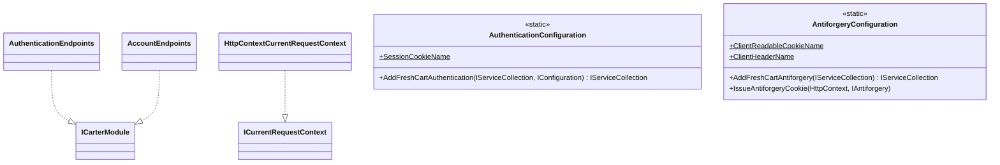

---

## Reporting service

### Domain

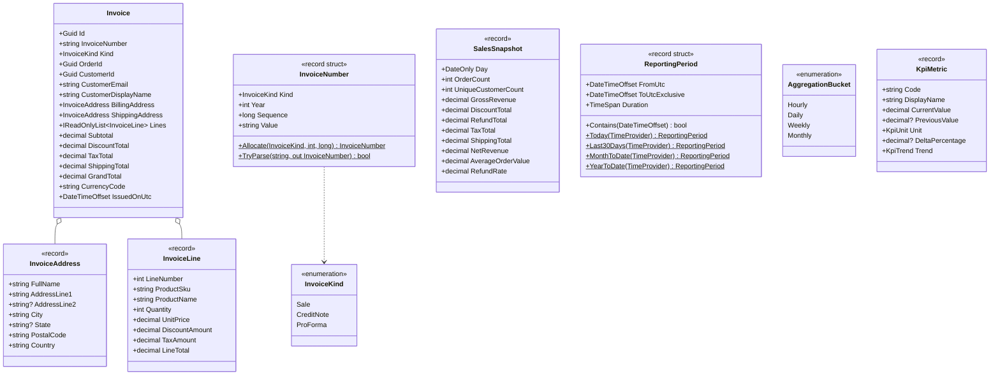

### Application

```mermaid
classDiagram
    class ISalesReadWarehouse {
        <<interface>>
        +GetAggregateAsync(ReportingPeriod, CancellationToken) Task~SalesSnapshot~
        +GetTimeSeriesAsync(ReportingPeriod, AggregationBucket, CancellationToken) Task~IReadOnlyList~SalesSnapshot~~
        +GetRevenueByCategoryAsync(ReportingPeriod, CancellationToken) Task~IReadOnlyList~RevenueByCategoryRow~~
        +GetRevenueByPaymentMethodAsync(ReportingPeriod, CancellationToken) Task~IReadOnlyList~RevenueByPaymentMethodRow~~
    }
    class IProductReadWarehouse {
        <<interface>>
    }
    class ICustomerReadWarehouse {
        <<interface>>
    }
    class IDeliveryReadWarehouse {
        <<interface>>
    }
    class IInvoiceRepository {
        <<interface>>
        +FindByNumberAsync(InvoiceNumber, CancellationToken) Task~Invoice?~
        +FindByOrderIdAsync(Guid, CancellationToken) Task~Invoice?~
        +AllocateNextNumberAsync(InvoiceKind, int, CancellationToken) Task~InvoiceNumber~
        +AddAsync(Invoice, CancellationToken) Task
    }
    class IInvoiceRenderer {
        <<interface>>
        +InvoiceRenderingFormat Format
        +RenderAsync(Invoice, CancellationToken) Task~RenderedDocument~
    }
    class IExcelExporter {
        <<interface>>
        +ExportTabularAsync(string, IEnumerable~TRow~, ExcelExportOptions?, CancellationToken) Task~RenderedDocument~
    }
    class IDocumentStore {
        <<interface>>
        +StoreAsync(string, string, ReadOnlyMemory~byte~, string, CancellationToken) Task~Uri~
        +OpenReadAsync(string, string, CancellationToken) Task~Stream~
        +CreateReadOnlySharedAccessSignatureAsync(string, string, TimeSpan, CancellationToken) Task~Uri~
    }
    class IProjectionInbox {
        <<interface>>
        +HasProcessedAsync(Guid, CancellationToken) Task~bool~
        +RecordProcessedAsync(Guid, CancellationToken) Task
    }
    class IProjectionWriter {
        <<interface>>
        +ApplyOrderConfirmedAsync(OrderConfirmedIntegrationEvent, CancellationToken) Task
        +ApplyOrderRefundedAsync(OrderRefundedIntegrationEvent, CancellationToken) Task
    }
    class GetSalesOverviewQueryHandler
    class GetSalesTimeSeriesQueryHandler
    class GetRevenueBreakdownQueryHandler
    class GetTopProductsQueryHandler
    class GetCustomerLeaderboardQueryHandler
    class GetInventoryHealthQueryHandler
    class GetDeliveryPerformanceQueryHandler
    class GenerateInvoiceCommandHandler
    class ExportSalesTransactionsCommandHandler
    class OrderConfirmedProjectionConsumer
    class OrderRefundedProjectionConsumer

    GetSalesOverviewQueryHandler ..> ISalesReadWarehouse
    GetSalesTimeSeriesQueryHandler ..> ISalesReadWarehouse
    GetRevenueBreakdownQueryHandler ..> ISalesReadWarehouse
    GetTopProductsQueryHandler ..> IProductReadWarehouse
    GetCustomerLeaderboardQueryHandler ..> ICustomerReadWarehouse
    GetInventoryHealthQueryHandler ..> IProductReadWarehouse
    GetDeliveryPerformanceQueryHandler ..> IDeliveryReadWarehouse
    GenerateInvoiceCommandHandler ..> IInvoiceRepository
    GenerateInvoiceCommandHandler ..> IInvoiceRenderer
    GenerateInvoiceCommandHandler ..> IDocumentStore
    ExportSalesTransactionsCommandHandler ..> ISalesReadWarehouse
    ExportSalesTransactionsCommandHandler ..> IExcelExporter
    OrderConfirmedProjectionConsumer ..> IProjectionInbox
    OrderConfirmedProjectionConsumer ..> IProjectionWriter
    OrderRefundedProjectionConsumer ..> IProjectionInbox
    OrderRefundedProjectionConsumer ..> IProjectionWriter
```

### Infrastructure

```mermaid
classDiagram
    class WarehouseDbContext {
        +DbSet~InvoiceRecord~ Invoices
        +DbSet~InvoiceLineRecord~ InvoiceLines
        +DbSet~InvoiceNumberSequence~ InvoiceNumberSequences
        +DbSet~ProjectionInboxEntry~ ProjectionInbox
    }
    class InvoiceRepository
    class DapperSalesReadWarehouse
    class DapperProductReadWarehouse
    class DapperCustomerReadWarehouse
    class DapperDeliveryReadWarehouse
    class WarehouseProjectionWriter
    class EntityFrameworkProjectionInbox
    class QuestPdfInvoiceRenderer
    class ClosedXmlExcelExporter
    class AzureBlobDocumentStore
    class DailySalesReportBackgroundService
    class MySqlWarehouseConnectionFactory
    class IWarehouseConnectionFactory {
        <<interface>>
    }

    InvoiceRepository ..|> IInvoiceRepository
    DapperSalesReadWarehouse ..|> ISalesReadWarehouse
    DapperProductReadWarehouse ..|> IProductReadWarehouse
    DapperCustomerReadWarehouse ..|> ICustomerReadWarehouse
    DapperDeliveryReadWarehouse ..|> IDeliveryReadWarehouse
    WarehouseProjectionWriter ..|> IProjectionWriter
    EntityFrameworkProjectionInbox ..|> IProjectionInbox
    QuestPdfInvoiceRenderer ..|> IInvoiceRenderer
    ClosedXmlExcelExporter ..|> IExcelExporter
    AzureBlobDocumentStore ..|> IDocumentStore
    DailySalesReportBackgroundService ..|> IHostedService
    MySqlWarehouseConnectionFactory ..|> IWarehouseConnectionFactory
    InvoiceRepository ..> WarehouseDbContext
    DapperSalesReadWarehouse ..> IWarehouseConnectionFactory
```

---

## Catalog service

Vertical Slice in a single web project; no layer split. Each feature folder owns its command or
query, handler, endpoint and validator. Marten over Postgres stores the documents; HybridCache
fronts single-product reads and the category tree.

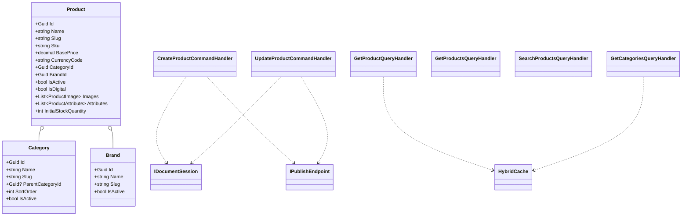

---

## Pricing service

Plain service classes behind a gRPC facade; no CQRS, no MediatR, no events. SQLite via EF Core
holds the discount rules and coupon codes.

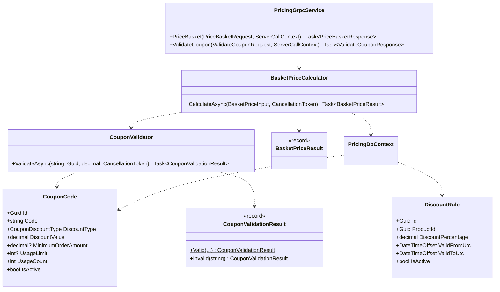

---

## Basket service

Vertical Slice with a repository decorator and a transactional outbox over Marten. The
`CachedBasketRepository` decorates `MartenBasketRepository`; the one money-critical event is
written to the outbox in the same Marten session that archives and deletes the basket.

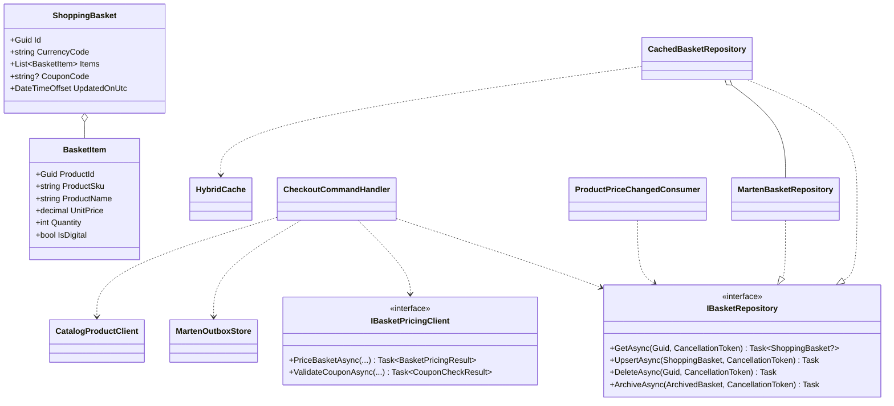

---

## Ordering service

Clean Architecture plus DDD plus a MassTransit saga state machine. The aggregate holds the
invariants; the saga holds the orchestration; work consumers hold the side effects.

### Domain

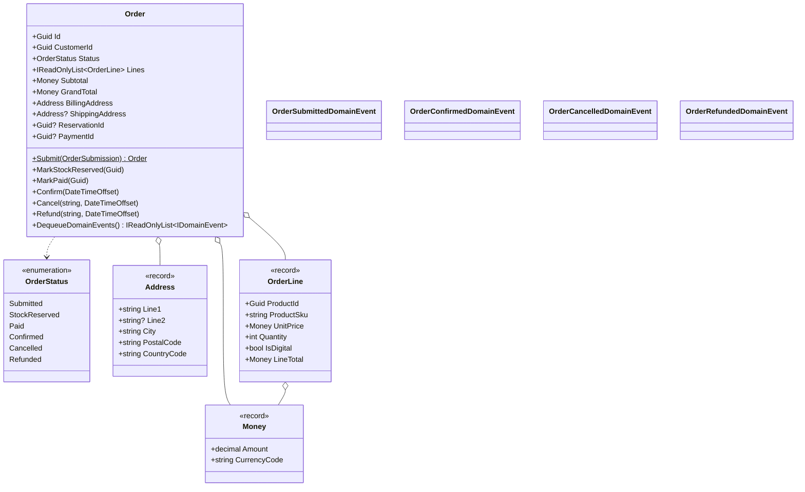

### Saga state machine

The correlation id is the order id. The machine moves through three states and finalizes; every
transition delegates its side effect to a work consumer.

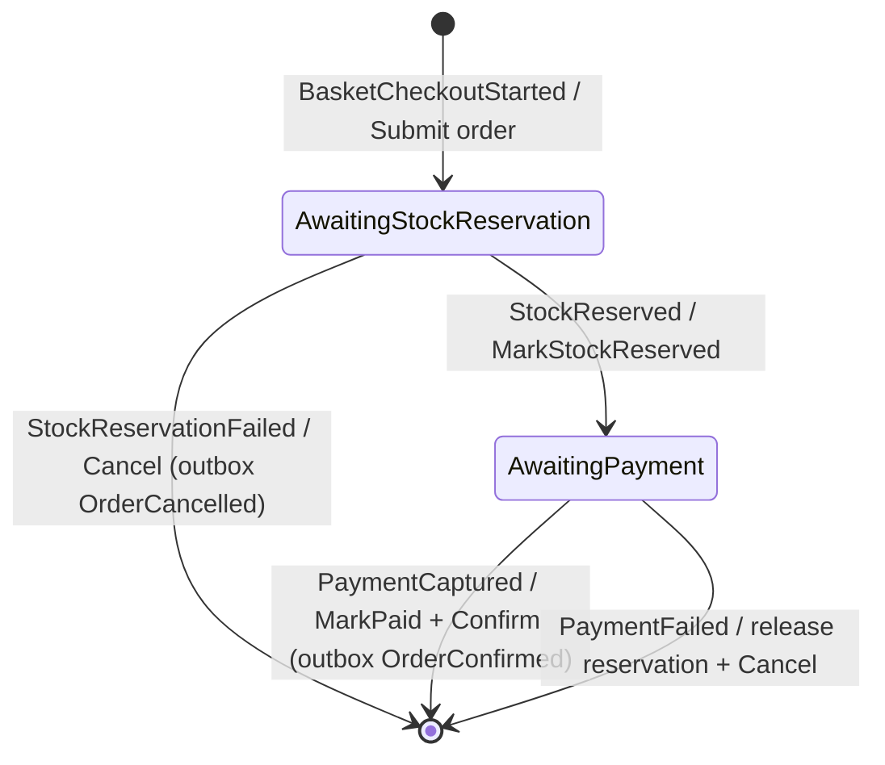

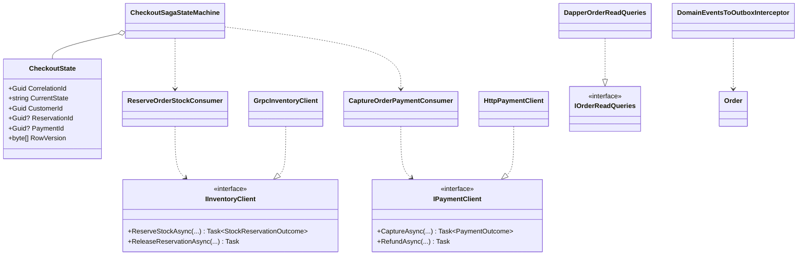

---

## Inventory service

Layered (endpoint or gRPC then service then repository) with Dapper and explicit transactions.
No CQRS and no rich domain; transactional correctness and read latency dominate.

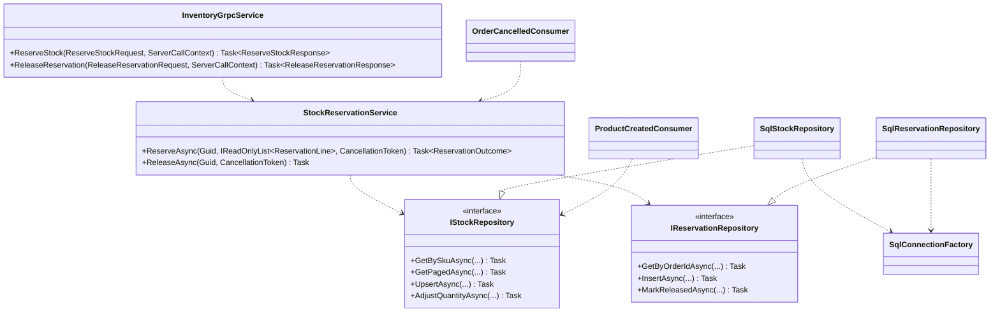

---

## Payment service

Clean Architecture plus event sourcing. The aggregate is rebuilt from events; a synchronous
projector keeps the SQL read model current after every append. A declined card is a domain
outcome, not a fault.

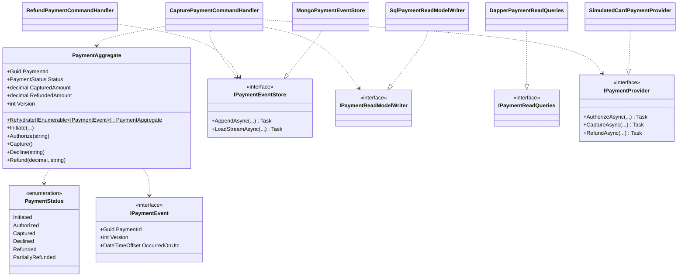

---

## Delivery service

Hexagonal. The domain core references no infrastructure; every external concern is an adapter
behind a port. The service captures the shipping address from `BasketCheckoutStarted` into a
local `PendingShipment`, then schedules on `OrderConfirmed`.

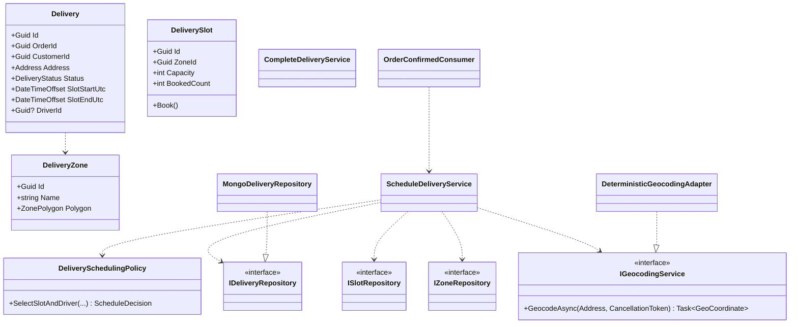

---

## Notification service

Bus consumers plus a SignalR hub plus channel senders. No domain logic; the complexity is
fan-out routing. History lives behind `INotificationStore` (MongoDB locally).

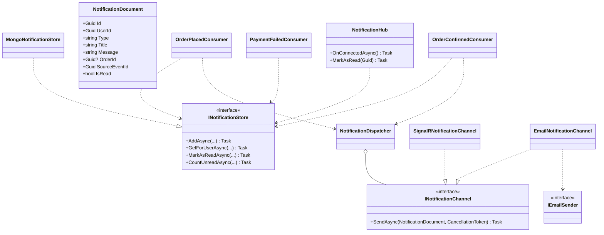

---

## CustomerSupport service

Connection manager plus SignalR hub plus repositories; no CQRS. The showcase is the round-robin
agent assignment, kept atomic across replicas by a Redis Lua script. Hub orchestration is
extracted into `ChatSessionCoordinator` so it can be unit-tested without a live connection.

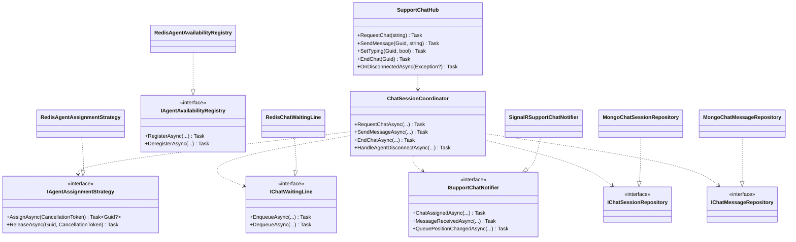

---

## Reviews service

Vertical Slice on MongoDB, the same slice idiom as Catalog. The verified-purchase badge comes
from purchase entitlements the service records locally from `OrderConfirmed`.

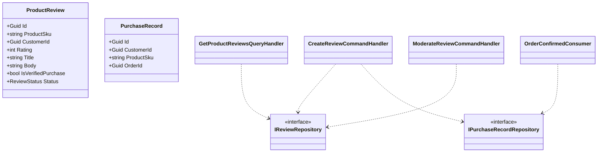

---

## API Gateway (YARP, BFF)

The trust boundary where the browser cookie becomes a downstream JWT. A YARP transform provider
applies the cookie-to-JWT exchange on every proxied route, including the WebSocket upgrade for
the hubs; minted tokens are cached to avoid re-signing every request.

```mermaid
classDiagram
    class TokenExchangeTransformProvider {
        <<ITransformProvider>>
        +ValidateRoute(TransformRouteValidationContext)
        +Apply(TransformBuilderContext)
    }
    class CookieToJwtTokenExchanger {
        +TryIssueToken(ClaimsPrincipal, out string) bool
    }
    class AntiforgeryValidationMiddleware {
        +InvokeAsync(HttpContext, RequestDelegate) Task
    }
    class IMemoryCache {
        <<interface>>
    }
    class IAntiforgery {
        <<interface>>
    }

    TokenExchangeTransformProvider ..> CookieToJwtTokenExchanger
    CookieToJwtTokenExchanger ..> IMemoryCache
    AntiforgeryValidationMiddleware ..> IAntiforgery
```

---

## Customer SPA (Angular 20)

Standalone, zoneless, signals-first. Cross-feature state lives in NgRx SignalStores; one store
per concern. SignalR connections are owned by the realtime stores and torn down on sign-out.

```mermaid
classDiagram
    class AuthStore {
        <<SignalStore>>
        +user: Signal
        +isAuthenticated: Signal
        +signIn()
        +signOut()
        +initialize()
    }
    class BasketStore {
        <<SignalStore>>
        +items: Signal
        +totals: Signal
        +addItem()
        +updateQuantity()
        +applyCoupon()
        +clearAfterCheckout()
    }
    class NotificationsStore {
        <<SignalStore>>
        +items: Signal
        +unreadCount: Signal
        +connectionState: Signal
        +markAsRead()
    }
    class SupportChatStore {
        <<SignalStore>>
        +session: Signal
        +messages: Signal
        +requestChat()
        +sendMessage()
        +endChat()
    }
    class SignalrConnectionFactory {
        +create(hubPath) HubConnection
    }
    class CatalogApiService
    class BasketApiService
    class OrdersApiService

    NotificationsStore ..> SignalrConnectionFactory
    SupportChatStore ..> SignalrConnectionFactory
    NotificationsStore ..> AuthStore
    BasketStore ..> BasketApiService
```

---

## Checkout saga (sequence)

The saga owns three states between Submitted and Confirmed. It calls Inventory and Payment
through work consumers (not from inside the state machine), so the state machine stays pure and
the side effects stay testable. Delivery is not a saga step: it consumes `OrderConfirmed`
downstream and schedules a slot against the shipping address it captured earlier from
`BasketCheckoutStarted`.

```mermaid
sequenceDiagram
    autonumber
    participant Browser
    participant Gateway as YARP Gateway
    participant Basket
    participant Bus as RabbitMQ
    participant Ordering as Ordering saga
    participant Inventory
    participant Payment
    participant Notification

    Browser->>Gateway: POST /api/basket/checkout (cookie)
    Gateway->>Basket: cookie to JWT, forward request
    Basket->>Basket: one Marten session: store outbox + archive + delete basket
    Basket-->>Browser: 202 Accepted { orderId }
    Basket->>Bus: BasketCheckoutStartedIntegrationEvent (OutboxPublisher)

    Bus->>Ordering: deliver event
    Ordering->>Ordering: Initially: Submit order, state to AwaitingStockReservation
    Ordering->>Inventory: ReserveOrderStock consumer calls ReserveStock (gRPC)
    Inventory-->>Ordering: StockReserved
    Ordering->>Ordering: MarkStockReserved, state to AwaitingPayment
    Ordering->>Payment: CaptureOrderPayment consumer calls POST /payments (Idempotency-Key)
    Payment-->>Ordering: PaymentCaptured
    Ordering->>Ordering: MarkPaid then Confirm, outbox emits OrderConfirmed, Finalize
    Ordering->>Bus: OrderConfirmedIntegrationEvent

    Bus->>Notification: deliver OrderConfirmed
    Notification->>Browser: notificationReceived over SignalR (Redis backplane)

    Note over Ordering,Inventory: PaymentFailed path: saga releases the reservation via the Inventory client, cancels the order, outbox emits OrderCancelled
```

---

## Invoice generation (sequence)

```mermaid
sequenceDiagram
    autonumber
    participant AdminSpa as Admin SPA
    participant Gateway as YARP
    participant Reporting
    participant Db as MySQL warehouse
    participant Blob as Azure Blob
    participant Browser

    AdminSpa->>Gateway: POST /invoices (JWT)
    Gateway->>Reporting: GenerateInvoiceCommand
    Reporting->>Db: FindByOrderIdAsync
    alt invoice already exists
        Db-->>Reporting: existing record
        Reporting->>Blob: mint SAS URL
        Reporting-->>AdminSpa: GenerateInvoiceResult (existing)
    else first generation
        Reporting->>Db: AllocateNextNumberAsync (row lock)
        Db-->>Reporting: INV-2026-000123
        Reporting->>Reporting: QuestPDF render
        Reporting->>Blob: upload PDF
        Reporting->>Db: INSERT invoice + lines
        Reporting->>Blob: mint SAS URL
        Reporting-->>AdminSpa: GenerateInvoiceResult (new)
    end
    AdminSpa->>Browser: open SAS URL
```
